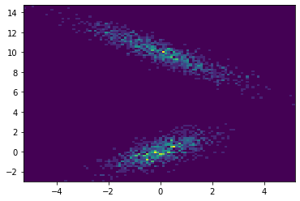

# Mixture Density Network in PyTorch with Full Covariance

Implementation of [Mixture Density Network](https://publications.aston.ac.uk/id/eprint/373/1/NCRG_94_004.pdf) in PyTorch with full covariance matrix support.

The full covariance matrix is implemented via Cholesky decomposition with `torch.distributions.MultivariateNormal`. See [this document](https://pytorch.org/docs/stable/distributions.html#multivariatenormal) for details.

## Citation

If you find this repository useful, please cite us using the citation button in the right column provided by GitHub.

## Usage

```python
import torch
from mdn import MixtureDensityNetwork

x = torch.randn(5, 1)
data = torch.randn(5, 2)

# 1D input, 2D output, 3 mixture components
model = MixtureDensityNetwork(
    dim_in=1, dim_out=2, n_components=2, 
    full_cov=True 
    # whether to use a full covariance, 
    # default full_cov=True
    )

# returns predicted pi and normal distributions
pi, normal = model(x) 

# compute negative log likelihood 
# as loss function for back prop
loss = model.loss(x, y).mean()

# use this to sample a trained model
samples = model.sample(x)
```

## Example

See [`example.ipynb`](./example.ipynb) for training a 2 component full covariance MDN with the following data:

&space;)

and




Note that an MDN with 2 diagonal covariance components can never recover such data.

## Reference

The code structure follows [this repo](https://github.com/tonyduan/mdn), which only supports diagonal covariances.